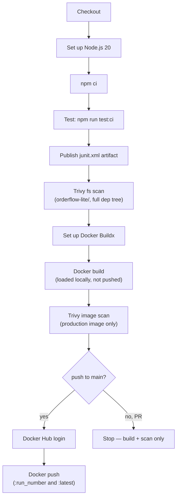

# OrderFlow-Lite CI (GitHub Actions)

[`orderflow-lite-ci.yml`](orderflow-lite-ci.yml) is a CI-only pipeline for
OrderFlow-Lite: test, scan, build, scan the image, push to Docker Hub. It
deliberately stops there — no Kubernetes deploy. That's still owned by the
`jenkins/Jenkinsfile.03-kubernetes-deploy` / `.04-trivy-scan` pipelines in
this repo; this workflow is a parallel CI path, not a replacement for CD.

## Pipeline flow

Both Trivy steps fail the job (`exit-code: 1`) on any fixable `HIGH` or
`CRITICAL` finding, which stops the job before the later steps run — a
failed fs or image scan means the push step never executes.

## Triggers

| Event | Branches | Effect |
|---|---|---|
| `push` | `main` | Full pipeline, including Docker Hub push |
| `pull_request` | targeting `main` | Test + both Trivy scans + Docker build only — never pushes |
| `workflow_dispatch` | any | Manual run from the Actions tab |

All three are scoped to changes under `orderflow-lite/**` or the workflow
file itself (`paths:` filter), so unrelated changes elsewhere in this
monorepo won't trigger it.

## Implementing this: one-time setup

1. **Create a Docker Hub access token** (not your account password):
   Docker Hub → Account Settings → Security → New Access Token. Grant it
   Read & Write scope.
2. **Add two repo secrets** in GitHub: Settings → Secrets and variables →
   Actions → New repository secret.

   | Secret | Value |
   |---|---|
   | `DOCKERHUB_USERNAME` | Your Docker Hub username |
   | `DOCKERHUB_TOKEN` | The access token from step 1 |

3. **Merge the workflow file** to `main` (or open a PR touching
   `orderflow-lite/**` first — that exercises Test + both Trivy scans +
   Docker build without needing the secrets yet, since the push steps are
   skipped on PRs).
4. **Trigger a run**: push to `main`, or use *Run workflow* under the
   Actions tab (`workflow_dispatch`) once secrets are in place.
5. **Verify**: check the Actions run for a green `Docker push` step, then
   confirm the image landed at
   `docker.io/<DOCKERHUB_USERNAME>/orderflow-lite:latest` on Docker Hub.

No other setup is required — this workflow only needs GitHub-hosted
runners (no self-hosted runner, no local registry, no cluster access).

## Notes

- **Image tags**: `${{ github.run_number }}` (a stable, incrementing
  per-workflow build number, mirroring `env.BUILD_NUMBER` in the Jenkins
  pipelines) and `latest`.
- **Why two Trivy steps**: the `fs` scan sees the whole dependency tree,
  including devDependencies — the only way this pipeline would ever catch
  something in `devDependencies`. The `image` scan only sees what's
  actually in the production image (`npm ci --omit=dev` in the
  Dockerfile), which is the exploitable surface if this image ships.
- **The seeded training CVE won't fail either scan**: `TRAINING_SEEDS.md`'s
  `jest-junit` → `uuid` finding (GHSA-w5hq-g745-h8pq) is `MODERATE`
  severity, and both steps only fail on `HIGH`/`CRITICAL`. It's also a
  devDependency, so the image scan wouldn't see it regardless of severity.
  This is expected, not a gap to fix.
- **Test results**: `junit.xml` is uploaded as a workflow artifact
  (`junit-results`) rather than rendered inline — GitHub Actions has no
  built-in JUnit viewer the way Jenkins does, so download it from the run
  summary page if you need the per-test detail.
